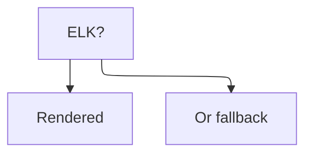
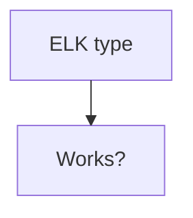

# ELK layout probe

## E1 frontmatter layout elk


```mermaid
---
config:
  layout: elk
---
flowchart TD
    A[ELK?] --> B[Rendered]
    A --> C[Or fallback]
```

## E2 flowchart-elk type


```mermaid
flowchart-elk TD
    A[ELK type] --> B[Works?]
```

## E3 math in markdown

inline: $E = mc^2$

```math
\frac{1}{2} \sum_{i=1}^{n} x_i
```
