# GitHub Mermaid Rendering Probe (2026-06-11)

## 00 info (version probe)

```mermaid
info
```

## 01 flowchart

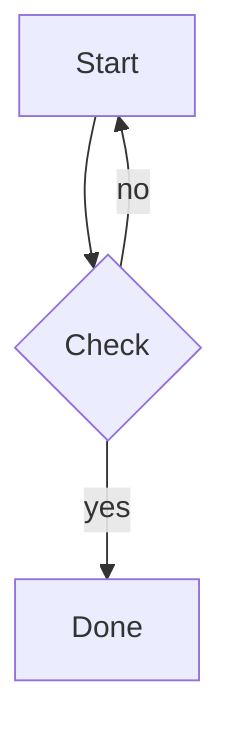

## 02 sequenceDiagram

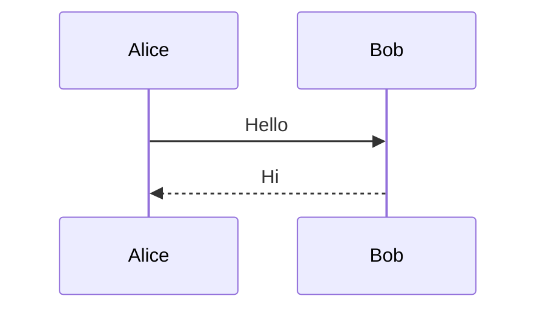

## 03 classDiagram

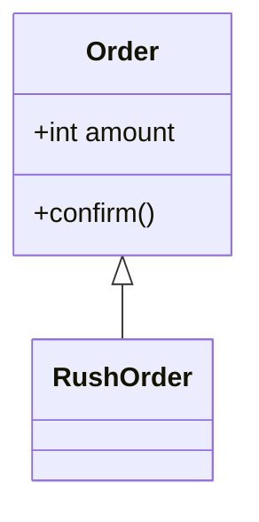

## 04 stateDiagram-v2

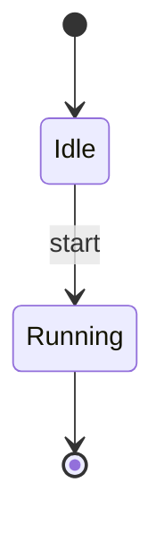

## 05 erDiagram

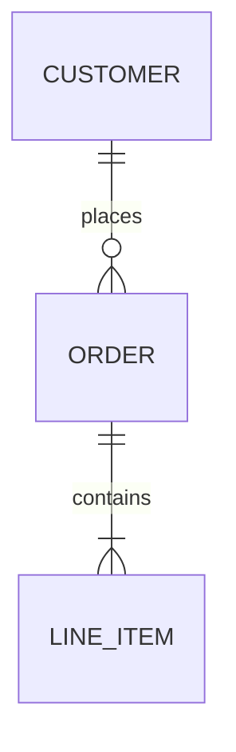

## 06 journey

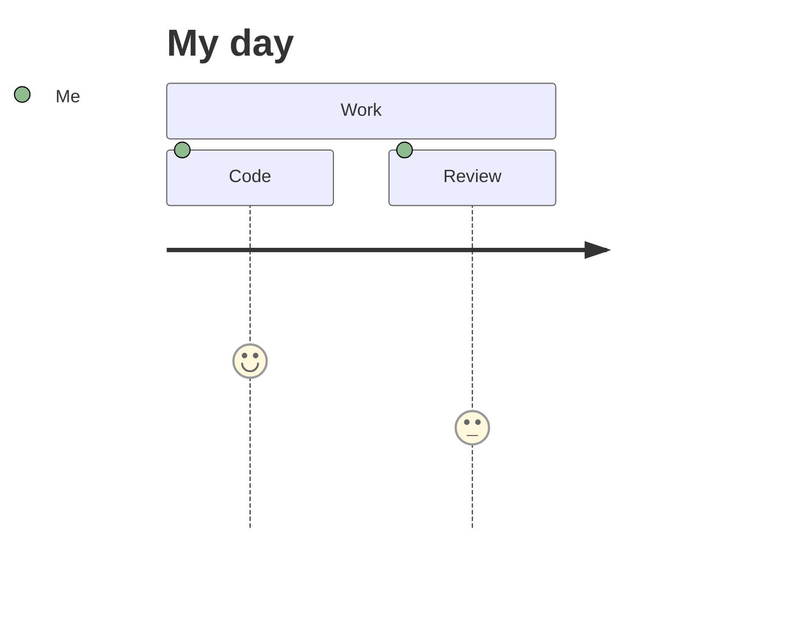

## 07 gantt

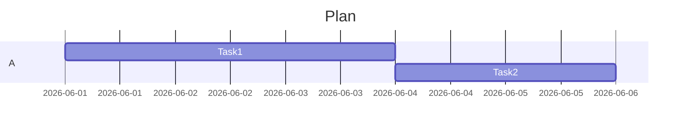

## 08 pie

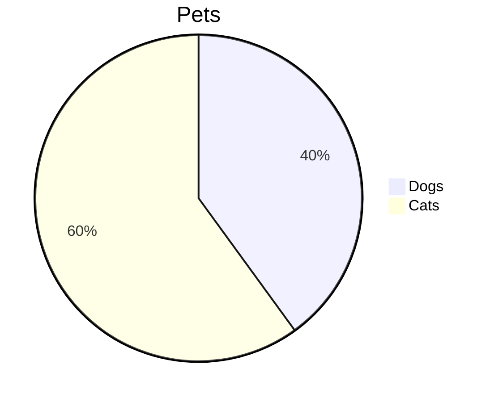

## 09 gitGraph

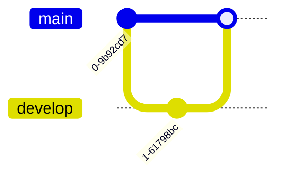

## 10 C4Context

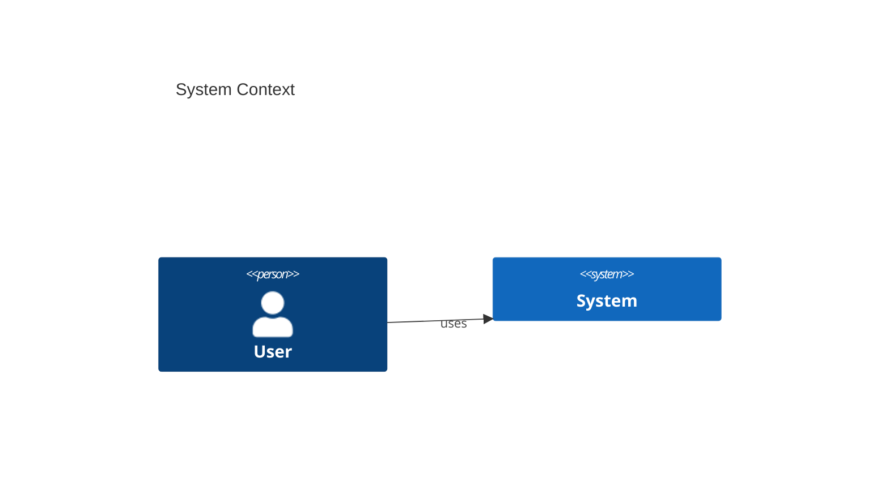

## 11 mindmap

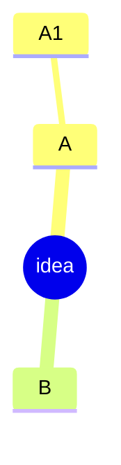

## 12 timeline

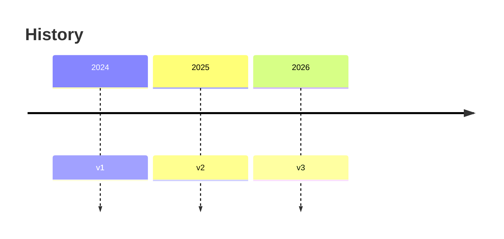

## 13 quadrantChart

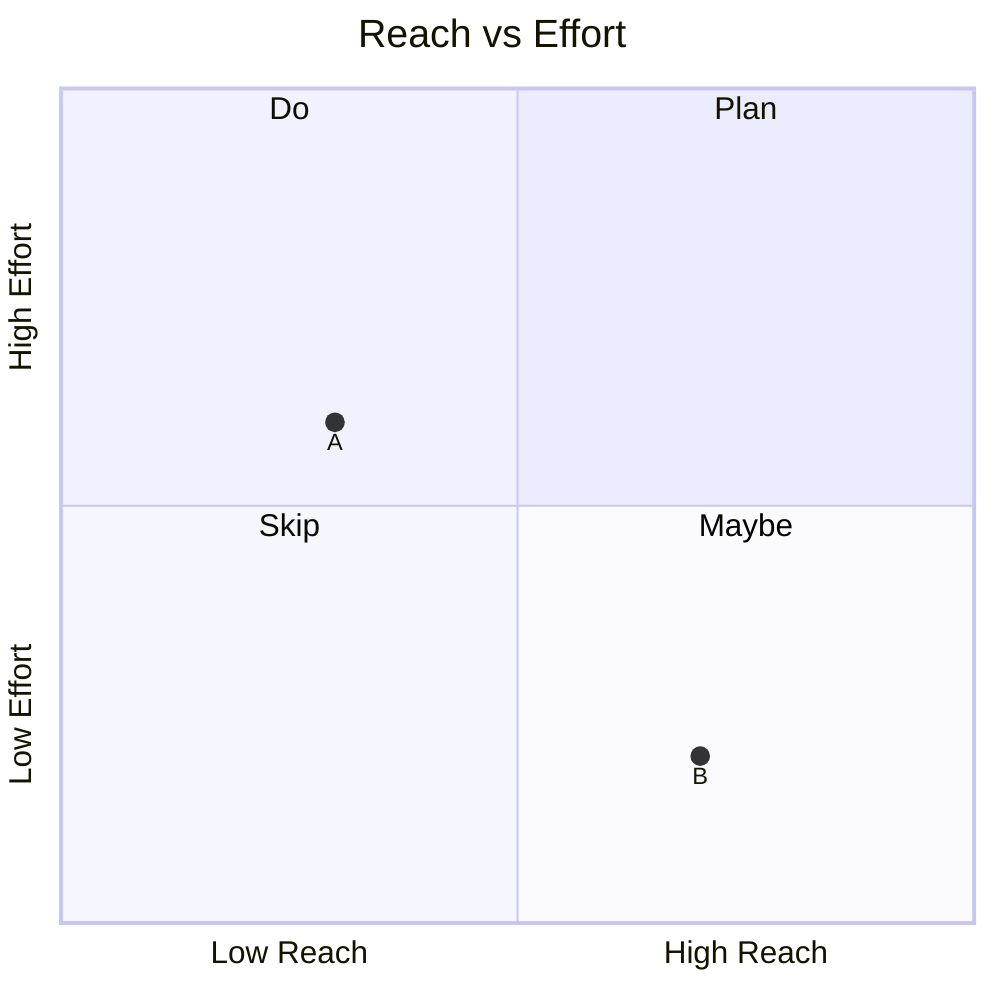

## 14 requirementDiagram

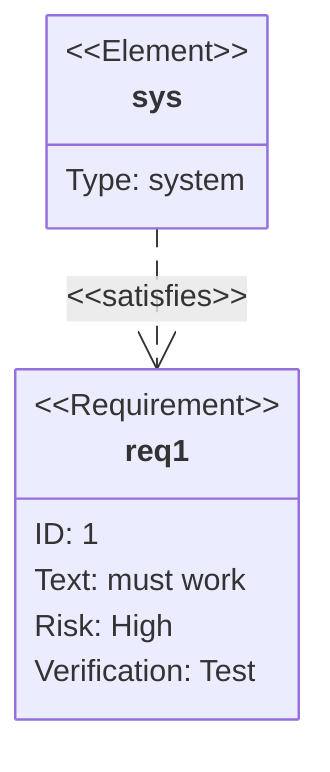

## 15 sankey-beta

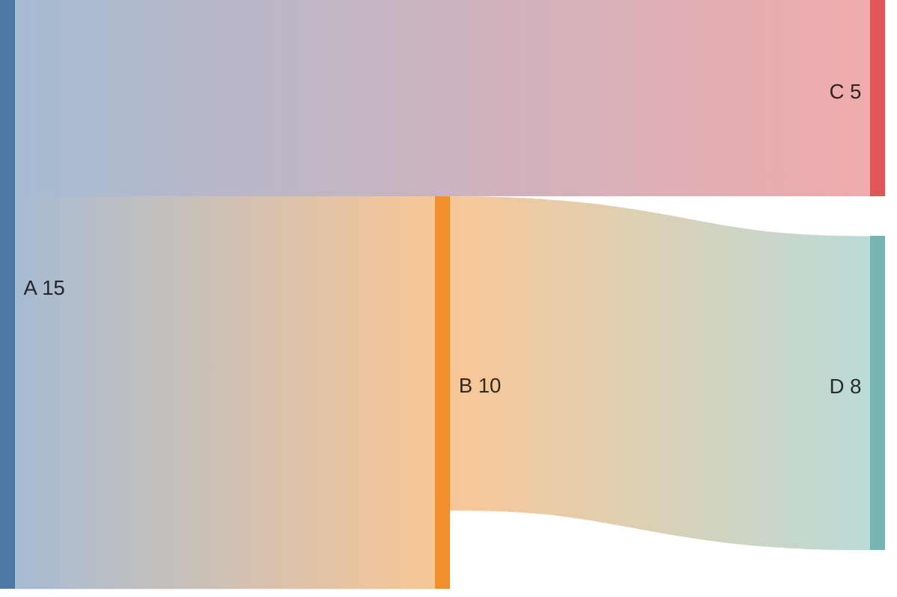

## 16 xychart-beta

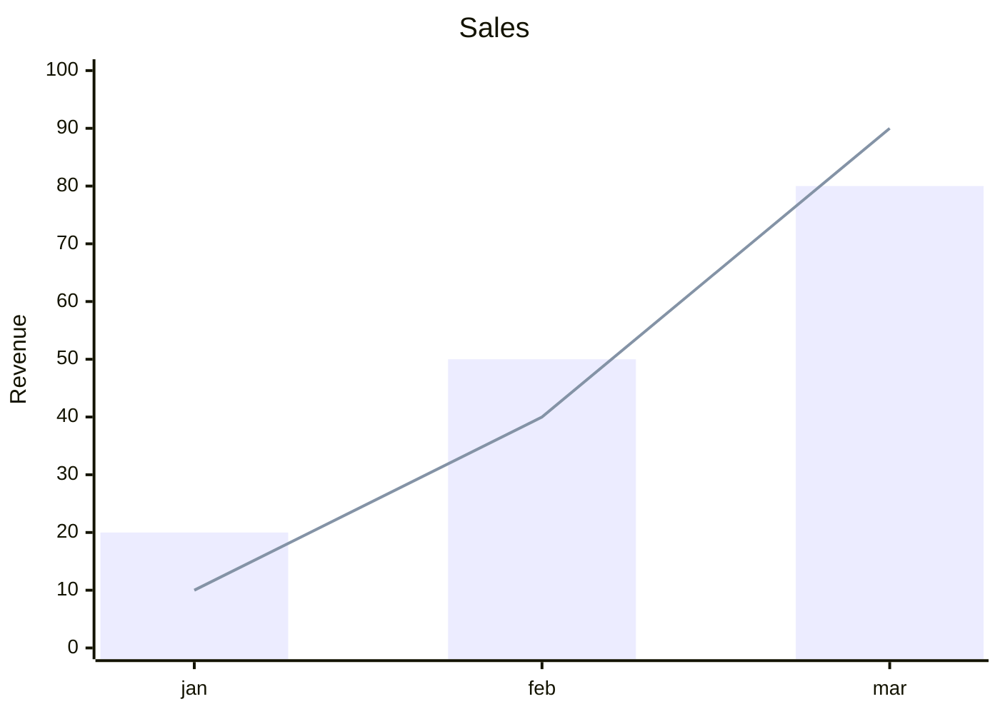

## 17 block-beta

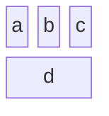

## 18 packet-beta

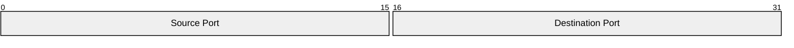

## 19 kanban

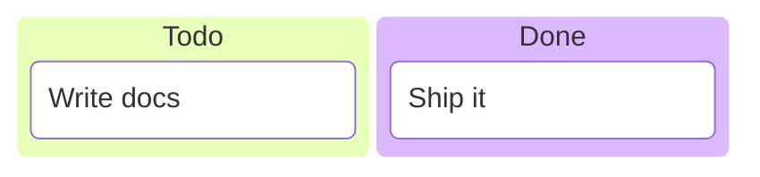

## 20 architecture-beta

```mermaid
architecture-beta
    group api(cloud)[API]
    service db(database)[DB] in api
    service web(server)[Web] in api
    web:R -- L:db
```

## 21 radar-beta

```mermaid
radar-beta
  axis a["A"], b["B"], c["C"]
  curve x{3, 4, 5}
  max 10
```

## 22 treemap-beta

```mermaid
treemap-beta
"Root"
    "Child A": 30
    "Child B": 70
```

## 23 zenuml (external plugin)

```mermaid
zenuml
    title Demo
    A->B: hello
```

## 24 Korean text probe (flowchart)

```mermaid
flowchart LR
    A[주문 생성] --> B{재고 확인}
    B -->|충분| C[결제 진행]
    B -->|부족| D[입고 대기 — 알림 발송]
```

## 25 Korean text probe (sequenceDiagram)

```mermaid
sequenceDiagram
    participant 사용자
    participant 서버
    사용자->>서버: 장바구니 담기 요청
    서버-->>사용자: 룰렛 게이지 갱신 응답
```

## 26 click interaction probe

```mermaid
flowchart LR
    A[Click me] --> B[Target]
    click A "https://example.com" "tooltip"
```

## 27 frontmatter config probe

```mermaid
---
config:
  theme: forest
  flowchart:
    curve: linear
---
flowchart LR
    X[Config] --> Y[Applied?]
```
